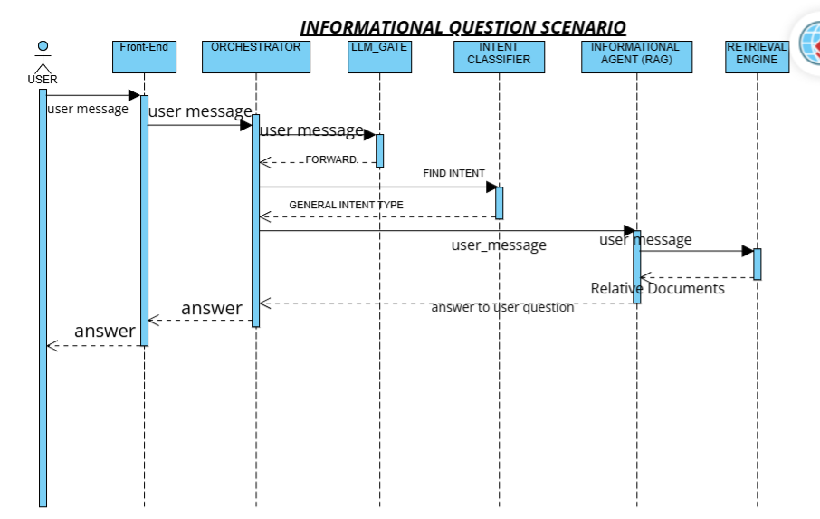
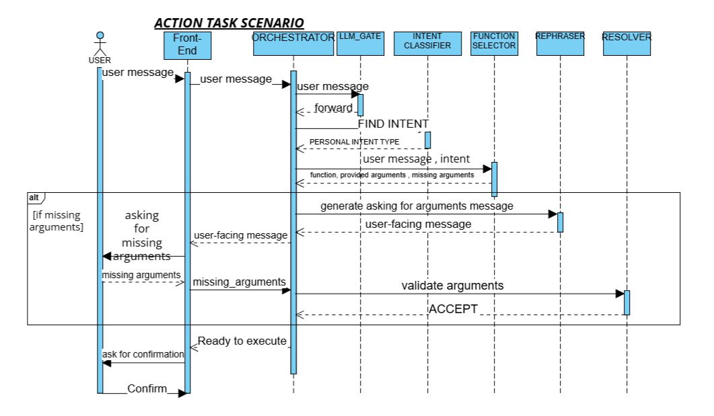

# PAYNOVA - Smart Banking with AI Agents

PAYNOVA is a university graduation project that explores how AI agents can provide a conversational interface for digital banking operations.

## What is this project?

PAYNOVA was designed to replace repetitive banking workflows and traditional interfaces with a more natural chat experience.

Instead of navigating through several screens, users can describe what they want in Arabic or English. The AI system then identifies the request and routes it to the appropriate banking workflow.

> PAYNOVA is an academic prototype and is not intended for real financial use.

## How does it work?

The system uses locally hosted language models to provide greater control over customer data and privacy.

Each request is classified into one of two processing paths:

| Request type  | Example                                  | Processing path                                                                                                                     |
| ------------- | ---------------------------------------- | ----------------------------------------------------------------------------------------------------------------------------------- |
| Informational | “What currencies does the bank support?” | Retrieves relevant bank documents and generates a grounded answer using RAG                                                         |
| Action        | “Exchange 100 USD to EUR”                | Selects a banking function, extracts the provided arguments, collects missing information, and prepares the action for confirmation |

The system separates these paths because answering a question and preparing a banking operation require different validation and safety controls.

## Demo

This silent demonstration shows the AI agent handling three banking requests:

1. Exchanging between currencies
2. Applying for a loan
3. Emptying a saving jar

https://github.com/user-attachments/assets/b1e43166-23ec-4344-b428-def4af8d3e50

## Request Flows

### Informational requests

Informational requests are routed to the retrieval pipeline. The system retrieves relevant bank documents and uses the RAG agent to generate a grounded answer.



### Action requests

Action requests are routed to the function-selection pipeline. The system identifies the required operation, extracts available arguments, collects missing information, and prepares the action for confirmation.



## Run Locally

The local setup has been verified on Windows using:

* Python 3.14.3
* Ollama 0.17.7
* `qwen3:1.7b` for language-model tasks
* `mxbai-embed-large:335m` for document embeddings

The repository includes:

* `requirements.txt` with the direct Python dependencies
* `requirements-lock.txt` with the exact tested dependency versions
* `.python-version` with the tested Python version
* `.env.example` with the required configuration
* A prebuilt local Chroma retrieval index

### 1. Clone the repository

```bash
git clone https://github.com/mohameddafes24-ops/Smart-bank-senior-project.git
cd Smart-bank-senior-project
```

### 2. Create a virtual environment

Windows PowerShell:

```powershell
python -m venv .venv
.\.venv\Scripts\Activate.ps1
```

Linux or macOS:

```bash
python3 -m venv .venv
source .venv/bin/activate
```

### 3. Install the Python dependencies

Use the lock file to reproduce the tested Python environment:

```bash
python -m pip install --upgrade pip
pip install -r requirements-lock.txt
```

The unpinned `requirements.txt` can be used to install only the direct project dependencies:

```bash
pip install -r requirements.txt
```

### 4. Install and configure Ollama

[Install Ollama](https://ollama.com/download), then download the required models:

```bash
ollama pull qwen3:1.7b
ollama pull mxbai-embed-large:335m
```

Confirm that the models are available:

```bash
ollama list
```

Ollama normally runs at:

```text
http://127.0.0.1:11434
```

If the Ollama service is not already running, start it with:

```bash
ollama serve
```

### 5. Create the environment file

Copy `.env.example` to `.env`.

Windows PowerShell:

```powershell
Copy-Item .env.example .env
```

Linux or macOS:

```bash
cp .env.example .env
```

The default configuration is:

```env
OLLAMA_BASE_URL=http://127.0.0.1:11434
OLLAMA_LLM_MODEL=qwen3:1.7b
OLLAMA_EMBEDDING_MODEL=mxbai-embed-large:335m
```

If port `11434` is unavailable, start Ollama on another port.

Windows PowerShell:

```powershell
$env:OLLAMA_HOST="127.0.0.1:11500"
ollama serve
```

Then update `.env`:

```env
OLLAMA_BASE_URL=http://127.0.0.1:11500
```

The `.env` file is excluded from Git and should not be committed.

### 6. Start the API

From the repository root:

```bash
cd deploy_agent_Crypto/FASTAPI2
python -m uvicorn main2:app --reload
```

The API will be available at:

```text
http://127.0.0.1:8000
```

Open the interactive API documentation at:

```text
http://127.0.0.1:8000/docs
```

A basic request can be tested through the `/chat` endpoint:

```json
{
  "message": "i want to apply for a loan",
  "state": {
    "Status": "Collecting_Intent",
    "currentIntent": null,
    "currentIntentType": null,
    "selected_function": null,
    "provided_arguments": {},
    "missing_arguments": [],
    "error_message": "",
    "error_code": null,
    "conversation_stack": [],
    "lastResponse": ""
  }
}
```

Ollama must remain running while the API is in use.

## Reproducibility Scope

The documented setup reproduces the locally tested API and retrieval workflow using pinned Python dependencies and explicitly named Ollama models.

The setup has been verified on Windows. It has not yet been validated through automated CI on Linux or macOS, and runtime performance depends on the available hardware.
